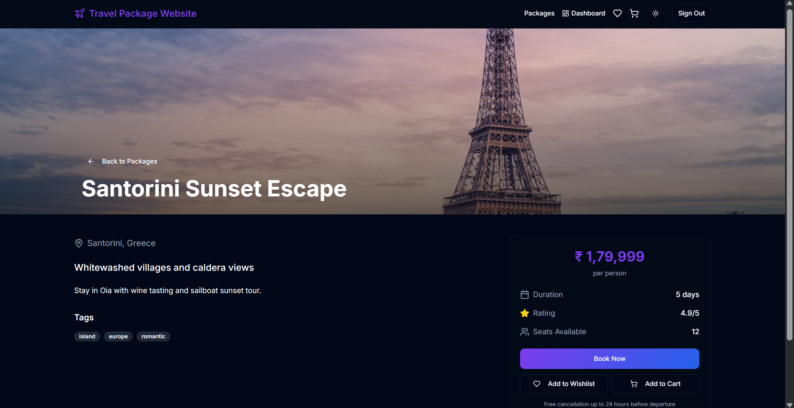
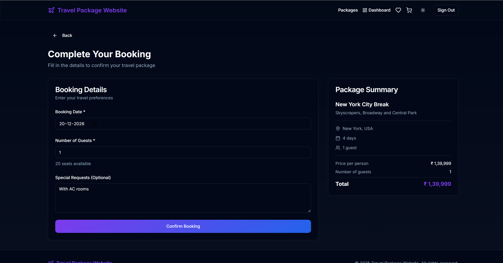
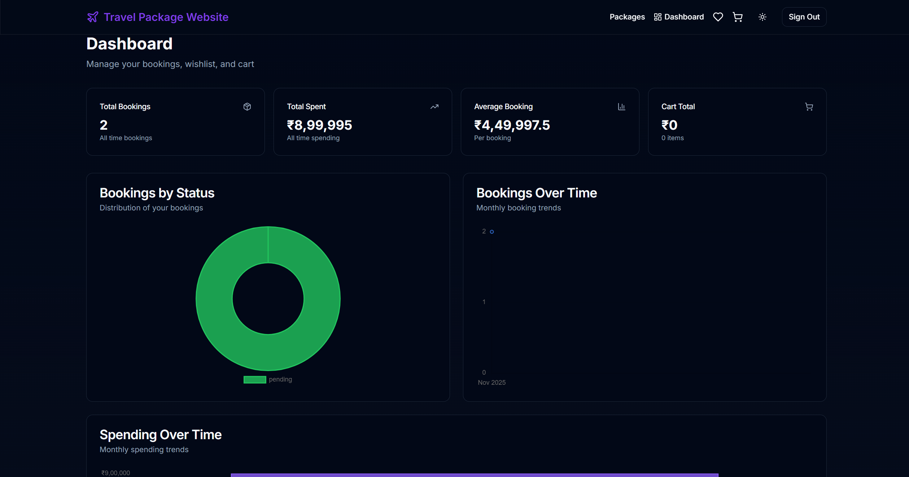
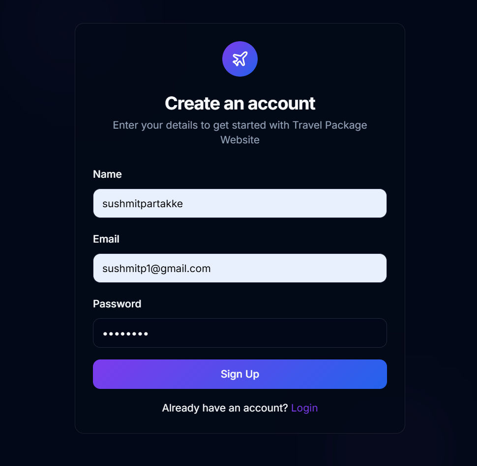
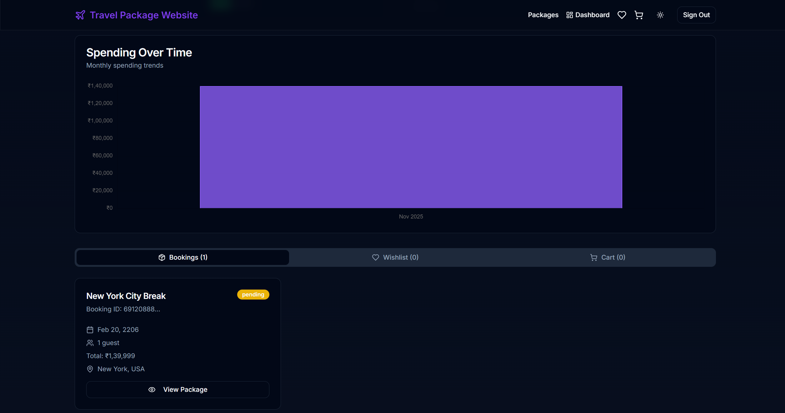
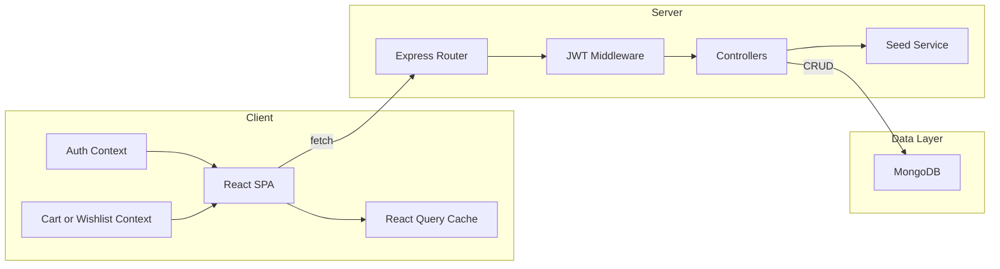
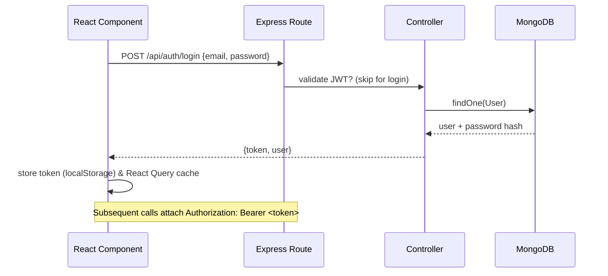
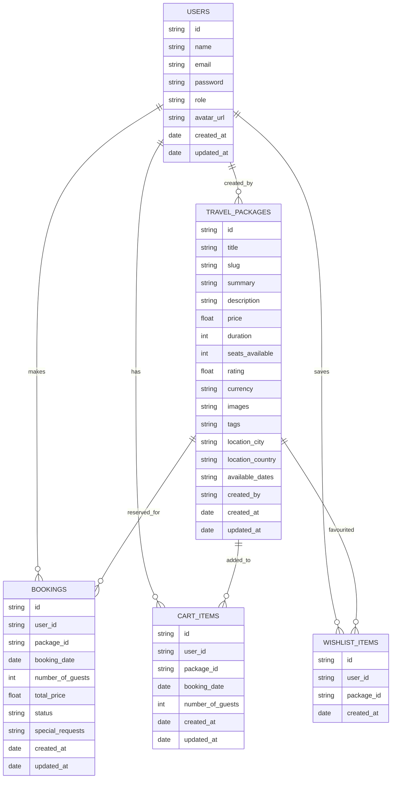

# Travel-package-website

An end-to-end travel package marketplace that lets visitors discover curated itineraries, sign up, build wishlists, manage carts, and confirm bookings—all powered by a modern React + Express + MongoDB stack.

---

## 📚 Table of Contents
1. [Project Structure](#-project-structure)
2. [Screenshots](#-screenshots)
3. [Key Features](#-key-features)
4. [Tech Stack](#-tech-stack)
5. [System Architecture](#-system-architecture)
6. [Request Flow](#-request-flow)
7. [Database Schema](#-database-schema)
8. [API Surface](#-api-surface)
9. [Environment & Configuration](#-environment--configuration)
10. [Setup & Installation](#-setup--installation)
11. [Development Workflow](#-development-workflow)
12. [Testing & Quality](#-testing--quality)
13. [Deployment Notes](#-deployment-notes)
14. [Troubleshooting](#-troubleshooting)
15. [Contributing](#-contributing)
16. [License](#-license)

---

## 📁 Project Structure

```
Travel-package-website/
├── backend/
│   ├── config/
│   ├── controllers/
│   ├── middleware/
│   ├── models/
│   ├── routes/
│   ├── scripts/
│   ├── supabase/
│   ├── utils/
│   ├── package.json
│   └── server.js
├── frontend/
│   ├── public/
│   ├── src/
│   │   ├── components/
│   │   ├── contexts/
│   │   ├── hooks/
│   │   ├── pages/
│   │   ├── services/
│   │   └── main.tsx
│   ├── package.json
│   ├── tailwind.config.ts
│   └── vite.config.ts
├── images/
│   └── image*.png
├── README.md
└── SETUP.md
```

Each half can be run independently: the backend exposes JSON endpoints under `/api/**`, and the frontend consumes them via `fetch` calls wrapped in React Query.

---

## 🖼 Screenshots

| Landing | Package Detail | Booking |
| --- | --- | --- |
|  |  |  |

| Dashboard | Sign Up | Dashboard – Bookings Tab |
| --- | --- | --- |
|  |  |  |

---

## ✨ Key Features
- **Curated Catalogue:** 20+ seeded travel packages with INR pricing, rich descriptions, and image galleries.
- **Advanced Filtering:** Search by text, filter by price range, duration, tags, and sort by rating or price.
- **User Accounts:** Email/password signup, JWT-protected sessions, role-driven access (admin vs. traveler).
- **Bookings & Cart:** Add packages to cart, adjust guests/dates, convert to confirmed bookings.
- **Wishlist:** Save favorite packages for quick access and conversion into bookings.
- **Dashboards:** Personalized analytics (totals, charts, booking history) built with Chart.js.
- **Admin Controls:** Create, edit, and soft-delete packages directly from the SPA (admin role only).
- **Responsive UI:** Dark theme, mobile-first layout, subtle animations, toast notifications, and ARIA-friendly components.

---

## 🧰 Tech Stack

| Layer | Technology | Purpose |
| ----- | ---------- | ------- |
| Frontend | React 18, TypeScript, Vite, Tailwind CSS, shadcn/ui | SPA, component styling, modern tooling |
| State/Data | React Query, Context API | Server-state caching, auth/cart/wishlist context |
| Backend | Node.js, Express, Mongoose | JSON API, schema modelling |
| Database | MongoDB (Compass/Atlas) | Persistent storage |
| Auth | JWT, bcryptjs | Secure login, role handling |
| Tooling | ESLint, Prettier, PostCSS | Code quality & CSS processing |

---

## 🧱 System Architecture



Rows:
- **Client**: The SPA orchestrates navigation and state.
- **Server**: Express routes authenticate via JWT middleware before calling controllers.
- **Data Layer**: Controllers persist data through Mongoose models. The seeding service ensures a rich product catalog in development.

---

## 🔁 Request Flow



Use similar flow for bookings (`POST /api/bookings`) and cart actions (`POST /api/cart`).

---

## 🗄 Database Schema



---

## 🔗 API Surface

Below is a concise overview. Consult controller files for full validation logic.

| Method | Endpoint | Description | Auth |
| ------ | -------- | ----------- | ---- |
| POST | `/api/auth/register` | Register new user | Public |
| POST | `/api/auth/login` | Authenticate and issue JWT | Public |
| POST | `/api/auth/logout` | Invalidate cookie/token | Auth |
| GET | `/api/auth/me` | Current user profile | Auth |
| GET | `/api/packages` | List packages (supports `search`, `tags`, `price`, `duration`, `sortBy`) | Public |
| GET | `/api/packages/slug/:slug` | Package by slug | Public |
| POST | `/api/packages` | Create package | Admin |
| PATCH | `/api/packages/:id` | Update package | Admin |
| DELETE | `/api/packages/:id` | Remove package | Admin |
| POST | `/api/packages/seed` | Idempotent seeding (dev only) | Dev |
| GET/POST | `/api/cart` | view/upsert cart | Auth |
| PATCH/DELETE | `/api/cart/:id` | update/remove cart item | Auth |
| GET/POST | `/api/bookings` | list/create bookings | Auth |
| GET/POST/DELETE | `/api/wishlist` | manage wishlist | Auth |

---

## ⚙ Environment & Configuration

**Backend `.env`**
```
PORT=5000
MONGODB_URI=mongodb://127.0.0.1:27017/travelDB
JWT_SECRET=replace_me
JWT_EXPIRES_IN=7d
JWT_COOKIE_MAX_AGE=604800000
CLIENT_ORIGIN=http://localhost:8080
```

**Frontend `.env`**
```
VITE_API_URL=http://localhost:5000
```

> Development mode automatically seeds INR-priced packages whenever the server boots, ensuring consistent content across environments.

---

## 🧑‍💻 Setup & Installation

1. **Clone repository**
   ```bash
   git clone https://github.com/Thesushmit/Travel-package-website.git
   cd Travel-package-website
   ```
2. **Install backend**
   ```bash
   cd backend
   npm install
   # add .env (see above)
   npm run dev
   ```
3. **Install frontend**
   ```bash
   cd ../frontend
   npm install
   # add .env (see above)
   npm run dev
   ```
4. Open the app at `http://localhost:8080`. Ensure the API health check `http://localhost:5000/api/health` returns JSON.

---

## 🔄 Development Workflow

- **Coding style**: ESLint + Prettier via Vite/TypeScript default configuration.
- **State**: Keep server interactions in `src/services/api.ts`; React Query caches responses automatically.
- **Auth tokens**: Stored in `localStorage` and mirrored via HTTP-only cookies.
- **Seeding**: `POST /api/packages/seed` updates/creates 20+ packages (idempotent).
- **Hot reload**: Vite dev server handles module replacement; Express restarts via Nodemon.

---

## ✅ Testing & Quality

- **Manual QA**: Use the dashboard metrics to confirm bookings, cart totals, wishlist counts.
- **Recommended**: Add unit tests via Vitest (frontend) and Jest (backend) depending on your team’s needs.
- **Linting**: `npm run lint` (frontend/backend) to maintain consistent style.

---

## 🚀 Deployment Notes

- Build the frontend with `npm run build` (outputs to `frontend/dist`).
- Deploy Express on a Node-compatible host (Render, Railway, Heroku). Remember to set production `.env` vars.
- Host static frontend (e.g., Vercel/Netlify) and point it to your API domain via `VITE_API_URL`.
- Enable HTTPS and update CORS origins (`CLIENT_ORIGIN`) for each deployed domain.

---

## 🧯 Troubleshooting

| Symptom | Likely Cause | Resolution |
| ------- | ------------ | ---------- |
| `Failed to fetch` in SPA | Backend not running or wrong `VITE_API_URL` | Start Express (`npm run dev`) and ensure `http://localhost:5000/api/health` works |
| Packages missing | Seed not executed or DB empty | Restart backend (auto-seed) or POST `/api/packages/seed` |
| CORS errors | `CLIENT_ORIGIN` mismatch | Update backend `.env` to include the frontend origin |
| Login 401 | Missing/expired token | Re-login; ensure JWT secret consistent across deploys |

---

## 🤝 Contributing
1. Fork the repository
2. Create your feature branch (`git checkout -b feature/awesome`)
3. Commit changes (`git commit -m "Add awesome"`)
4. Push (`git push origin feature/awesome`)
5. Open a pull request

---

## 📄 License
MIT © Thesushmit – feel free to adapt and extend the project for your own travel ventures.
