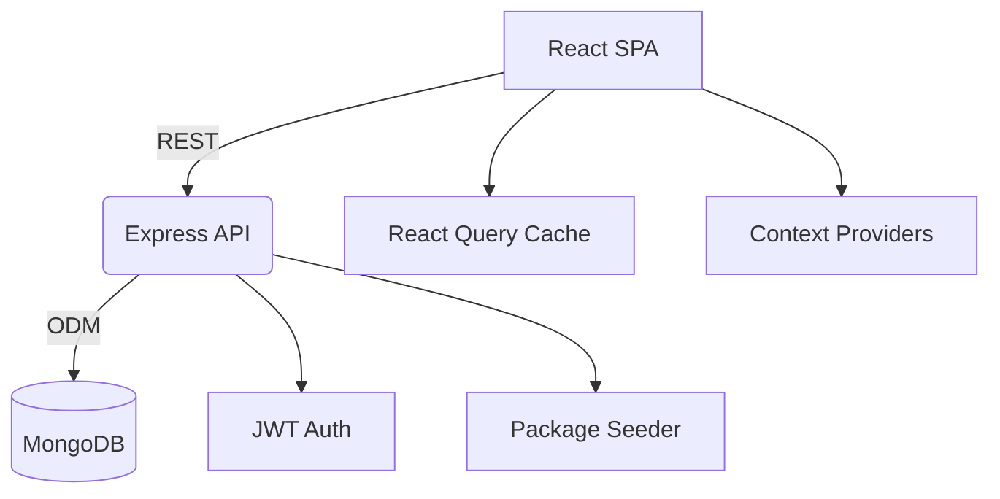

# Wanderlust Hub

A full-stack travel booking platform built with a modern React + Express + MongoDB stack.

## 🚀 What’s Inside

- **Frontend**: React 18, TypeScript, Vite, Tailwind, shadcn/ui, React Query, React Router
- **Backend**: Node.js, Express, MongoDB, Mongoose, JWT, bcrypt
- **Tooling**: ESLint, Prettier, PostCSS, Vite SWC

## 🧱 Architecture Overview



## 🗄️ Database Schema

```mermaid
erDiagram
  USERS ||--o{ BOOKINGS : makes
  USERS ||--o{ CART_ITEMS : owns
  USERS ||--o{ WISHLIST_ITEMS : saves
  USERS ||--o{ TRAVEL_PACKAGES : created_by
  TRAVEL_PACKAGES ||--o{ BOOKINGS : reserved_for
  TRAVEL_PACKAGES ||--o{ CART_ITEMS : added_to
  TRAVEL_PACKAGES ||--o{ WISHLIST_ITEMS : favourited

  USERS {
    string id PK
    string name
    string email UNIQUE
    string password HASH
    string role "user|admin"
    string avatar_url
    date created_at
    date updated_at
  }

  TRAVEL_PACKAGES {
    string id PK
    string title
    string slug UNIQUE
    string summary
    string description
    number price "INR"
    number duration "days"
    number seats_available
    number rating
    string currency
    string images[]
    string tags[]
    string location_city
    string location_country
    string available_dates[]
    string created_by FK
    date created_at
    date updated_at
  }

  BOOKINGS {
    string id PK
    string user_id FK
    string package_id FK
    date booking_date
    number number_of_guests
    number total_price
    string status
    string special_requests
    date created_at
    date updated_at
  }

  CART_ITEMS {
    string id PK
    string user_id FK
    string package_id FK
    date booking_date
    number number_of_guests
    date created_at
    date updated_at
  }

  WISHLIST_ITEMS {
    string id PK
    string user_id FK
    string package_id FK
    date created_at
  }
```

## 🛠️ Getting Started

### Prerequisites
- Node.js ≥ 18
- npm
- MongoDB (local or Atlas)

### 1. Clone & Install
```bash
git clone https://github.com/Thesushmit/Travel-package-website.git
cd Travel-package-website
```

### 2. Backend Setup
```bash
cd backend
npm install
cat <<'EOF' > .env
PORT=5000
MONGODB_URI=mongodb://127.0.0.1:27017/travelDB
JWT_SECRET=replace_me
JWT_EXPIRES_IN=7d
JWT_COOKIE_MAX_AGE=604800000
CLIENT_ORIGIN=http://localhost:8080
EOF
npm run dev
```
> In development the API auto-seeds 20+ INR-priced sample packages on start.

### 3. Frontend Setup
```bash
cd ../frontend
npm install
cat <<'EOF' > .env
VITE_API_URL=http://localhost:5000
EOF
npm run dev
```
The SPA runs at `http://localhost:8080` and communicates with the Express API at `http://localhost:5000`.

## 📦 Scripts

| Area | Command | Description |
|------|---------|-------------|
| Backend | `npm run dev` | Start Express with nodemon |
| Backend | `npm run start` | Production start |
| Frontend | `npm run dev` | Start Vite dev server |
| Frontend | `npm run build` | Generate production build |
| Frontend | `npm run preview` | Preview production build |

## 🤝 Contributing
1. Fork the repo
2. Create a branch (`git checkout -b feature/awesome`)
3. Commit (`git commit -m "Add feature"`)
4. Push (`git push origin feature/awesome`)
5. Open a pull request

## 📄 License
MIT © Thesushmit
