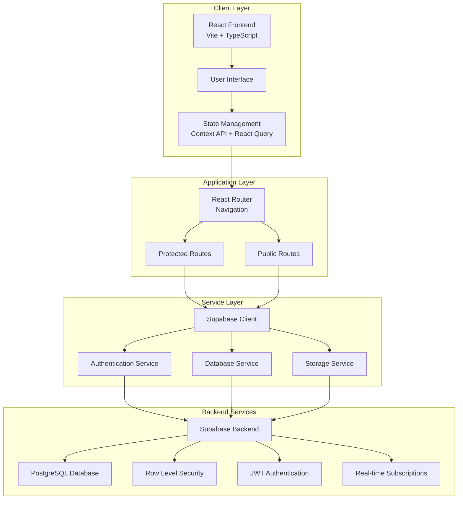

# Travel Package Website - Book Your Dream Vacation

A modern, full-featured travel package booking platform built with React, TypeScript, and Supabase.

🌐 **Live Website**: [https://travel-package-website-nu.vercel.app/](https://travel-package-website-nu.vercel.app/)

📦 **Repository**: [https://github.com/Thesushmit/Travel-package-website](https://github.com/Thesushmit/Travel-package-website)

---

## 📋 Table of Contents

- [Overview](#overview)
- [System Architecture](#system-architecture)
- [Tech Stack](#tech-stack)
- [Database Schema](#database-schema)
- [Use Cases](#use-cases)
- [User Flows](#user-flows)
- [API Documentation](#api-documentation)
- [Installation & Setup](#installation--setup)
- [Project Structure](#project-structure)
- [Features](#features)
- [Deployment](#deployment)
- [Contributing](#contributing)

---

## 🎯 Overview

Travel Package Website is a full-stack web application that enables users to browse, search, and book travel packages. The platform includes features like user authentication, package management, booking system, shopping cart, wishlist, and an admin panel for package management.

### Key Capabilities

- **User Management**: Registration, authentication, role-based access control
- **Package Browsing**: Search, filter, and view travel packages
- **Booking System**: Create and manage travel bookings
- **Shopping Cart**: Add packages to cart and manage items
- **Wishlist**: Save favorite packages for later
- **Admin Panel**: Manage packages, users, and bookings
- **Dashboard**: View bookings, cart, and wishlist in one place

---

## 🏗️ System Architecture

### High-Level Architecture



### Component Architecture


---

## 💻 Tech Stack

### Frontend

| Technology | Version | Purpose |
|------------|---------|---------|
| **React** | 18.3.1 | UI Framework |
| **TypeScript** | 5.8.3 | Type Safety |
| **Vite** | 5.4.19 | Build Tool & Dev Server |
| **React Router** | 6.30.1 | Client-side Routing |
| **React Query** | 5.83.0 | Server State Management |
| **Tailwind CSS** | 3.4.17 | Utility-first CSS |
| **shadcn/ui** | Latest | UI Component Library |
| **Chart.js** | 4.5.1 | Data Visualization |
| **React Hook Form** | 7.61.1 | Form Management |
| **Zod** | 3.25.76 | Schema Validation |
| **date-fns** | 3.6.0 | Date Utilities |

### Backend

| Technology | Version | Purpose |
|------------|---------|---------|
| **Supabase** | 2.80.0 | Backend-as-a-Service |
| **PostgreSQL** | Latest | Relational Database |
| **Supabase Auth** | Latest | Authentication Service |
| **Row Level Security** | Built-in | Database Security |
| **JWT** | Built-in | Token-based Auth |

### Development Tools

- **ESLint** - Code Linting
- **TypeScript** - Type Checking
- **PostCSS** - CSS Processing
- **Autoprefixer** - CSS Vendor Prefixes

---

## 🗄️ Database Schema

### Entity Relationship Diagram


### Database Tables

#### 1. **profiles**
Stores user profile information linked to Supabase Auth users.

| Column | Type | Description |
|--------|------|-------------|
| `id` | UUID (PK) | References `auth.users(id)` |
| `name` | TEXT | User's full name |
| `email` | TEXT | User's email address |
| `avatar_url` | TEXT | Profile picture URL |
| `created_at` | TIMESTAMPTZ | Account creation timestamp |

#### 2. **user_roles**
Manages user roles (admin/user) for role-based access control.

| Column | Type | Description |
|--------|------|-------------|
| `id` | UUID (PK) | Primary key |
| `user_id` | UUID (FK) | References `auth.users(id)` |
| `role` | app_role | Enum: 'admin' or 'user' |
| `created_at` | TIMESTAMPTZ | Role assignment timestamp |

#### 3. **travel_packages**
Stores travel package information.

| Column | Type | Description |
|--------|------|-------------|
| `id` | UUID (PK) | Primary key |
| `slug` | TEXT (UNIQUE) | URL-friendly identifier |
| `title` | TEXT | Package title |
| `summary` | TEXT | Short description |
| `description` | TEXT | Full description |
| `price` | NUMERIC | Package price |
| `currency` | TEXT | Currency code (default: INR) |
| `images` | TEXT[] | Array of image URLs |
| `duration` | INTEGER | Trip duration in days |
| `location_city` | TEXT | City name |
| `location_country` | TEXT | Country name |
| `tags` | TEXT[] | Array of tags |
| `available_dates` | JSONB | Available booking dates |
| `rating` | NUMERIC | Package rating (0-5) |
| `seats_available` | INTEGER | Available seats |
| `created_by` | UUID (FK) | Admin who created package |
| `created_at` | TIMESTAMPTZ | Creation timestamp |
| `updated_at` | TIMESTAMPTZ | Last update timestamp |

#### 4. **bookings**
Stores user bookings for travel packages.

| Column | Type | Description |
|--------|------|-------------|
| `id` | UUID (PK) | Primary key |
| `user_id` | UUID (FK) | References `auth.users(id)` |
| `package_id` | UUID (FK) | References `travel_packages(id)` |
| `booking_date` | DATE | Selected booking date |
| `number_of_guests` | INTEGER | Number of guests |
| `status` | TEXT | Status: pending, confirmed, cancelled, completed |
| `total_price` | NUMERIC | Total booking price |
| `created_at` | TIMESTAMPTZ | Booking creation timestamp |
| `updated_at` | TIMESTAMPTZ | Last update timestamp |

#### 5. **wishlist**
Stores user's saved packages.

| Column | Type | Description |
|--------|------|-------------|
| `id` | UUID (PK) | Primary key |
| `user_id` | UUID (FK) | References `auth.users(id)` |
| `package_id` | UUID (FK) | References `travel_packages(id)` |
| `created_at` | TIMESTAMPTZ | Added timestamp |

#### 6. **cart**
Stores user's shopping cart items.

| Column | Type | Description |
|--------|------|-------------|
| `id` | UUID (PK) | Primary key |
| `user_id` | UUID (FK) | References `auth.users(id)` |
| `package_id` | UUID (FK) | References `travel_packages(id)` |
| `booking_date` | DATE | Selected booking date |
| `number_of_guests` | INTEGER | Number of guests |
| `created_at` | TIMESTAMPTZ | Added timestamp |
| `updated_at` | TIMESTAMPTZ | Last update timestamp |

---

## 📊 Use Cases

### Use Case Diagram


### Detailed Use Cases

#### **UC-1: Browse Travel Packages**

**Actor**: User (Guest/Registered)

**Preconditions**: User is on the home page or packages page

**Main Flow**:
1. User navigates to packages page
2. System displays list of available packages
3. User can filter by location, price, duration, tags
4. User can sort by price, rating, newest
5. User views package cards with key information

**Postconditions**: User can see available packages

---

#### **UC-2: Search Packages**

**Actor**: User (Guest/Registered)

**Preconditions**: User is on packages page

**Main Flow**:
1. User enters search query in search bar
2. System searches in title, location, description
3. System displays matching packages
4. User can refine search with filters

**Postconditions**: User sees filtered results

---

#### **UC-3: View Package Details**

**Actor**: User (Guest/Registered)

**Preconditions**: User is browsing packages

**Main Flow**:
1. User clicks on a package card
2. System navigates to package detail page
3. System displays full package information:
   - Images gallery
   - Description
   - Price and currency
   - Duration
   - Location details
   - Available dates
   - Rating
   - Seats available
4. User can add to cart or wishlist
5. User can proceed to booking

**Postconditions**: User views complete package details

---

#### **UC-4: Add Package to Cart**

**Actor**: Registered User

**Preconditions**: User is authenticated and viewing package details

**Main Flow**:
1. User clicks "Add to Cart" button
2. System prompts for number of guests and booking date
3. User enters details
4. System validates input
5. System adds package to user's cart
6. System updates cart badge count
7. System shows success notification

**Postconditions**: Package added to cart, cart count updated

---

#### **UC-5: Add Package to Wishlist**

**Actor**: Registered User

**Preconditions**: User is authenticated and viewing package

**Main Flow**:
1. User clicks wishlist icon
2. System checks if package already in wishlist
3. If not, system adds package to wishlist
4. System updates wishlist badge count
5. System shows success notification

**Postconditions**: Package added to wishlist, wishlist count updated

---

#### **UC-6: Create Booking**

**Actor**: Registered User

**Preconditions**: User is authenticated and viewing package details or cart

**Main Flow**:
1. User clicks "Book Now" or proceeds from cart
2. System navigates to booking page
3. User selects booking date
4. User selects number of guests
5. System calculates total price
6. User reviews booking details
7. User confirms booking
8. System validates:
   - Date is available
   - Seats are available
   - Number of guests is valid
9. System creates booking record
10. System updates package seats available
11. System removes item from cart (if booked from cart)
12. System shows success notification
13. System redirects to dashboard

**Postconditions**: Booking created, seats updated, cart updated

---

#### **UC-7: View Dashboard**

**Actor**: Registered User

**Preconditions**: User is authenticated

**Main Flow**:
1. User navigates to dashboard
2. System displays tabs: Bookings, Wishlist, Cart
3. User can switch between tabs
4. System displays:
   - **Bookings Tab**: All bookings with status, charts
   - **Wishlist Tab**: Saved packages
   - **Cart Tab**: Cart items with totals
5. User can perform actions on items in each tab

**Postconditions**: User views all personal data

---

#### **UC-8: Manage Cart**

**Actor**: Registered User

**Preconditions**: User has items in cart

**Main Flow**:
1. User navigates to dashboard → Cart tab
2. System displays all cart items
3. User can:
   - Update number of guests
   - Update booking date
   - Remove items
   - Proceed to booking
4. System updates cart in real-time
5. System recalculates totals

**Postconditions**: Cart updated, totals recalculated

---

#### **UC-9: Manage Wishlist**

**Actor**: Registered User

**Preconditions**: User has items in wishlist

**Main Flow**:
1. User navigates to dashboard → Wishlist tab
2. System displays all wishlist items
3. User can:
   - View package details
   - Add to cart
   - Remove from wishlist
4. System updates wishlist in real-time

**Postconditions**: Wishlist updated

---

#### **UC-10: View Booking History**

**Actor**: Registered User

**Preconditions**: User has made bookings

**Main Flow**:
1. User navigates to dashboard → Bookings tab
2. System displays all bookings
3. System shows:
   - Booking details
   - Package information
   - Status
   - Total price
   - Booking date
4. System displays charts:
   - Bookings by status (Doughnut chart)
   - Bookings over time (Line chart)
   - Spending over time (Bar chart)
5. User can filter by status

**Postconditions**: User views booking history and analytics

---

#### **UC-11: Create Package (Admin)**

**Actor**: Admin

**Preconditions**: User is authenticated and has admin role

**Main Flow**:
1. Admin navigates to admin panel
2. Admin clicks "Create Package"
3. Admin fills form:
   - Title, summary, description
   - Price and currency
   - Images (multiple)
   - Duration
   - Location (city, country)
   - Tags
   - Available dates
   - Seats available
4. System validates input
5. System generates slug from title
6. System creates package record
7. System shows success notification

**Postconditions**: New package created and visible to users

---

#### **UC-12: Edit Package (Admin)**

**Actor**: Admin

**Preconditions**: Package exists, user is admin

**Main Flow**:
1. Admin navigates to admin panel
2. Admin selects package to edit
3. System loads package data into form
4. Admin modifies fields
5. System validates changes
6. System updates package record
7. System updates `updated_at` timestamp
8. System shows success notification

**Postconditions**: Package updated

---

#### **UC-13: Delete Package (Admin)**

**Actor**: Admin

**Preconditions**: Package exists, user is admin

**Main Flow**:
1. Admin navigates to admin panel
2. Admin selects package to delete
3. System shows confirmation dialog
4. Admin confirms deletion
5. System checks for existing bookings
6. If bookings exist, system prevents deletion (or marks as inactive)
7. If no bookings, system deletes package
8. System shows success notification

**Postconditions**: Package deleted (or marked inactive)

---

#### **UC-16: User Registration**

**Actor**: Guest User

**Preconditions**: User is not authenticated

**Main Flow**:
1. User navigates to signup page
2. User enters:
   - Name
   - Email
   - Password
   - Confirm password
3. System validates:
   - Email format
   - Password strength
   - Password match
4. System creates user account via Supabase Auth
5. System creates profile record
6. System assigns default 'user' role
7. System sends verification email (if enabled)
8. System logs user in automatically
9. System redirects to home page

**Postconditions**: User account created, user logged in

---

#### **UC-17: User Login**

**Actor**: Guest User

**Preconditions**: User has an account

**Main Flow**:
1. User navigates to login page
2. User enters email and password
3. System validates credentials via Supabase Auth
4. If valid, system creates session
5. System loads user profile and role
6. System redirects to home page or intended destination

**Postconditions**: User logged in, session active

---

#### **UC-18: User Logout**

**Actor**: Authenticated User

**Preconditions**: User is logged in

**Main Flow**:
1. User clicks logout button
2. System clears session
3. System clears local state
4. System redirects to home page

**Postconditions**: User logged out, session cleared

---

## 🔄 User Flows

### Authentication Flow


### Booking Flow


### Cart Management Flow


---

## 🔌 API Documentation

### Supabase Client Methods

#### Authentication

```typescript
// Sign Up
supabase.auth.signUp({
  email: string,
  password: string,
  options: {
    data: { name: string }
  }
})

// Sign In
supabase.auth.signInWithPassword({
  email: string,
  password: string
})

// Sign Out
supabase.auth.signOut()

// Get Current User
supabase.auth.getUser()

// Get Session
supabase.auth.getSession()
```

#### Database Queries

```typescript
// Get Packages
supabase
  .from('travel_packages')
  .select('*')
  .order('created_at', { ascending: false })

// Get Package by Slug
supabase
  .from('travel_packages')
  .select('*')
  .eq('slug', slug)
  .single()

// Create Booking
supabase
  .from('bookings')
  .insert({
    user_id: string,
    package_id: string,
    booking_date: date,
    number_of_guests: number,
    status: 'pending',
    total_price: number
  })

// Get User Bookings
supabase
  .from('bookings')
  .select(`
    *,
    travel_packages (*)
  `)
  .eq('user_id', userId)

// Add to Cart
supabase
  .from('cart')
  .insert({
    user_id: string,
    package_id: string,
    booking_date: date,
    number_of_guests: number
  })

// Add to Wishlist
supabase
  .from('wishlist')
  .insert({
    user_id: string,
    package_id: string
  })
```

---

## 🚀 Installation & Setup

### Prerequisites

- **Node.js** v18 or higher
- **npm** or **yarn**
- **Supabase Account** (free tier available)
- **Git** (for cloning)

### Step-by-Step Installation

#### 1. Clone Repository

```bash
git clone https://github.com/Thesushmit/Travel-package-website.git
cd Travel-package-website
```

#### 2. Backend Setup

```bash
# Navigate to backend directory
cd backend

# Install dependencies
npm install

# Create .env file
cat > .env << EOF
VITE_SUPABASE_URL=your_supabase_project_url
VITE_SUPABASE_PUBLISHABLE_KEY=your_supabase_anon_key
SUPABASE_SERVICE_ROLE_KEY=your_service_role_key
EOF

# Verify connection
npm run check-connection
```

#### 3. Database Setup

1. Go to [Supabase Dashboard](https://app.supabase.com)
2. Create a new project
3. Navigate to SQL Editor
4. Run migrations in order:
   - `backend/supabase/migrations/20251109045238_3a28aee0-4d3a-41b6-b945-d16bffa677d2.sql`
   - `backend/supabase/migrations/20250110000000_add_bookings_wishlist_cart.sql`
   - `backend/supabase/migrations/20250110000001_fix_rls_policies.sql`
   - `backend/supabase/migrations/20250110000002_add_package_insert_function.sql`

#### 4. Add Sample Data (Optional)

```bash
cd backend
npm run add-packages
```

#### 5. Frontend Setup

```bash
# Navigate to frontend directory
cd ../frontend

# Install dependencies
npm install

# Create .env file
cat > .env << EOF
VITE_SUPABASE_URL=your_supabase_project_url
VITE_SUPABASE_PUBLISHABLE_KEY=your_supabase_anon_key
EOF
```

#### 6. Start Development Server

```bash
# From frontend directory
npm run dev
```

Application will be available at `http://localhost:8080`

---

## 📁 Project Structure

```
travel-package-website/
│
├── backend/                      # Backend configuration
│   ├── config/
│   │   └── db.js                # Supabase client config
│   ├── models/
│   │   └── User.js              # User model
│   ├── routes/
│   │   └── authRoutes.js        # Auth routes (docs)
│   ├── controllers/
│   │   └── authController.js    # Auth logic (docs)
│   ├── middleware/
│   │   └── authMiddleware.js    # Auth middleware (docs)
│   ├── utils/
│   │   └── generateToken.js     # Token utils (docs)
│   ├── supabase/
│   │   ├── config.toml          # Supabase config
│   │   └── migrations/          # Database migrations
│   ├── scripts/
│   │   ├── add-sample-packages.ts
│   │   └── check-supabase-connection.ts
│   └── package.json
│
├── frontend/                     # React frontend
│   ├── src/
│   │   ├── main.tsx             # Entry point
│   │   ├── App.tsx              # Root component
│   │   ├── App.css              # Global styles
│   │   ├── index.css            # Base styles
│   │   │
│   │   ├── components/          # React components
│   │   │   ├── Navbar.tsx       # Navigation bar
│   │   │   ├── Footer.tsx       # Footer
│   │   │   ├── Hero.tsx         # Hero section
│   │   │   ├── PackageCard.tsx  # Package card
│   │   │   ├── ProtectedRoute.tsx # Route protection
│   │   │   └── ui/              # shadcn/ui components
│   │   │
│   │   ├── pages/               # Page components
│   │   │   ├── Home.tsx         # Landing page
│   │   │   ├── Packages.tsx     # Packages listing
│   │   │   ├── PackageDetail.tsx # Package details
│   │   │   ├── Booking.tsx       # Booking page
│   │   │   ├── Dashboard.tsx    # User dashboard
│   │   │   ├── Admin.tsx        # Admin panel
│   │   │   ├── Login.tsx        # Login page
│   │   │   ├── Signup.tsx       # Signup page
│   │   │   └── NotFound.tsx     # 404 page
│   │   │
│   │   ├── contexts/            # React contexts
│   │   │   ├── AuthContext.tsx  # Authentication
│   │   │   ├── CartContext.tsx   # Shopping cart
│   │   │   └── WishlistContext.tsx # Wishlist
│   │   │
│   │   ├── hooks/               # Custom hooks
│   │   │   ├── use-mobile.tsx
│   │   │   └── use-toast.ts
│   │   │
│   │   ├── services/            # API services
│   │   │   └── api.ts
│   │   │
│   │   ├── integrations/        # Third-party integrations
│   │   │   └── supabase/
│   │   │       ├── client.ts    # Supabase client
│   │   │       └── types.ts     # TypeScript types
│   │   │
│   │   └── lib/                 # Utilities
│   │       ├── utils.ts         # General utilities
│   │       └── currency.ts      # Currency formatting
│   │
│   ├── public/                  # Static assets
│   │   ├── favicon.svg
│   │   ├── favicon.ico
│   │   └── robots.txt
│   │
│   ├── index.html               # HTML entry point
│   ├── package.json             # Dependencies
│   ├── vite.config.ts           # Vite config
│   ├── tsconfig.json            # TypeScript config
│   ├── tailwind.config.ts       # Tailwind config
│   └── postcss.config.js        # PostCSS config
│
├── README.md                    # This file
├── SETUP.md                     # Detailed setup guide
├── vercel.json                  # Vercel deployment config
└── .gitignore                   # Git ignore rules
```

---

## ✨ Features

### Core Features

#### 1. **User Authentication**
- Email/password registration
- Secure login with JWT tokens
- Session persistence
- Role-based access control (Admin/User)
- Protected routes

#### 2. **Package Management**
- Browse all packages
- Search by title, location, description
- Filter by location, price, duration, tags
- Sort by price, rating, newest
- View detailed package information
- Image galleries
- Rating system

#### 3. **Booking System**
- Create bookings with date selection
- Guest count selection
- Price calculation
- Booking status tracking (pending, confirmed, cancelled, completed)
- Booking history in dashboard
- Analytics charts (Chart.js)

#### 4. **Shopping Cart**
- Add packages to cart
- Update guest count and dates
- Remove items
- View cart total
- Proceed to booking from cart
- Real-time cart updates

#### 5. **Wishlist**
- Save favorite packages
- Quick add/remove
- View wishlist in dashboard
- Add to cart from wishlist
- Visual indicators

#### 6. **User Dashboard**
- Tabbed interface (Bookings, Wishlist, Cart)
- Booking analytics with charts:
  - Bookings by status (Doughnut)
  - Bookings over time (Line)
  - Spending over time (Bar)
- Quick actions on items
- Statistics cards

#### 7. **Admin Panel**
- Create new packages
- Edit existing packages
- Delete packages
- Manage package details
- Image upload support

#### 8. **UI/UX Features**
- Responsive design (mobile, tablet, desktop)
- Dark mode support
- Loading states
- Error handling
- Toast notifications
- Smooth animations
- Professional styling with shadcn/ui

---

## 🚢 Deployment

### Vercel Deployment

The project is configured for Vercel deployment with `vercel.json`.

#### Steps:

1. **Push to GitHub**
   ```bash
   git add .
   git commit -m "Initial commit"
   git push origin main
   ```

2. **Connect to Vercel**
   - Go to [Vercel Dashboard](https://vercel.com)
   - Import your GitHub repository
   - Vercel will auto-detect the configuration

3. **Configure Environment Variables**
   - Add in Vercel dashboard:
     - `VITE_SUPABASE_URL`
     - `VITE_SUPABASE_PUBLISHABLE_KEY`

4. **Deploy**
   - Vercel will automatically build and deploy
   - Build command: `cd frontend && npm install && npm run build`
   - Output directory: `frontend/dist`

### Environment Variables

**Frontend (.env)**
```env
VITE_SUPABASE_URL=your_supabase_project_url
VITE_SUPABASE_PUBLISHABLE_KEY=your_supabase_anon_key
```

**Backend (.env)**
```env
VITE_SUPABASE_URL=your_supabase_project_url
VITE_SUPABASE_PUBLISHABLE_KEY=your_supabase_anon_key
SUPABASE_SERVICE_ROLE_KEY=your_service_role_key
```

---

## 🧪 Testing

### Manual Testing Checklist

- [ ] User registration and login
- [ ] Package browsing and search
- [ ] Package detail view
- [ ] Add to cart functionality
- Add to wishlist
- [ ] Create booking
- Dashboard views (bookings, wishlist, cart)
- Admin package management
- Protected routes
- Responsive design

See [SETUP.md](./SETUP.md) for detailed testing guide.

---

## 📝 Available Scripts

### Frontend Scripts

```bash
cd frontend

npm run dev      # Start development server
npm run build    # Build for production
npm run preview  # Preview production build
npm run lint     # Run ESLint
```

### Backend Scripts

```bash
cd backend

npm run add-packages      # Add sample packages
npm run check-connection  # Verify Supabase connection
```

---

## 🤝 Contributing

1. Fork the repository
2. Create a feature branch (`git checkout -b feature/amazing-feature`)
3. Commit your changes (`git commit -m 'Add amazing feature'`)
4. Push to the branch (`git push origin feature/amazing-feature`)
5. Open a Pull Request

---

## 📄 License

This project is open source and available under the [MIT License](LICENSE).

---

## 🆘 Support

For issues or questions:
- Check [SETUP.md](./SETUP.md) for setup help
- Review [Supabase Documentation](https://supabase.com/docs)
- Review [React Documentation](https://react.dev)
- Open an issue on GitHub

---

## 👨‍💻 Author

**Thesushmit**

- GitHub: [@Thesushmit](https://github.com/Thesushmit)
- Repository: [Travel-package-website](https://github.com/Thesushmit/Travel-package-website)

---

**Made with ❤️ using React, TypeScript, and Supabase**
